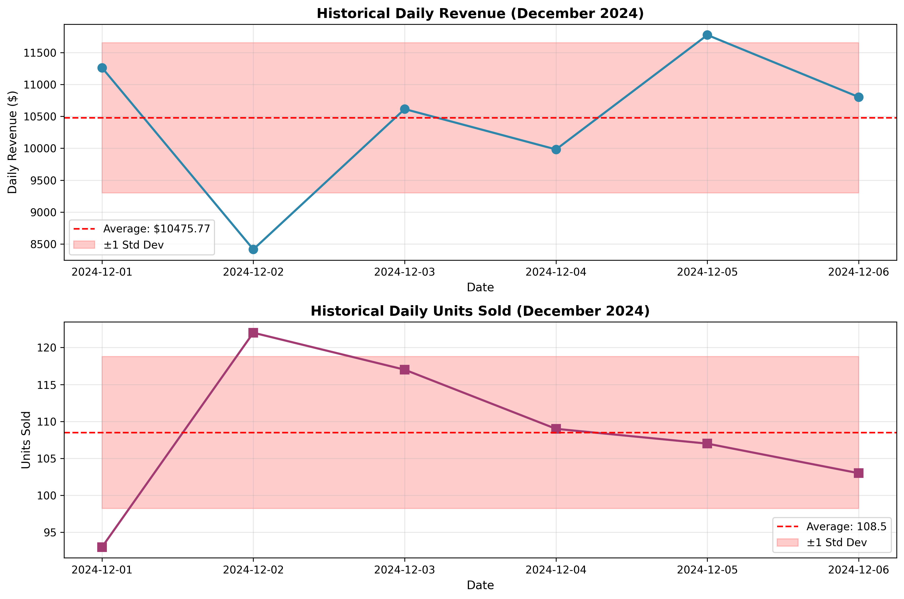
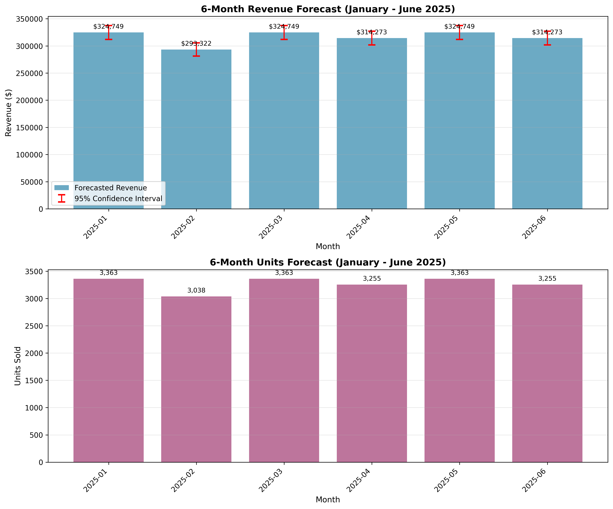
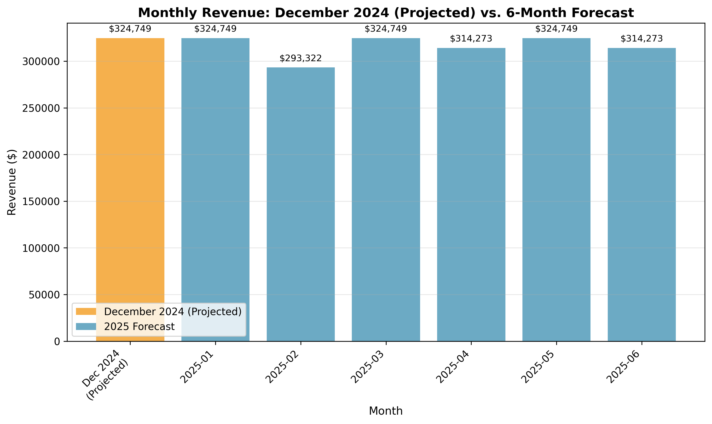

# Sales Forecast Report: 6-Month Projection (January - June 2025)

**Report Date:** May 31, 2026  
**Forecast Period:** January 2025 - June 2025  
**Historical Data Period:** December 1-6, 2024

---

## Executive Summary

Based on historical sales data from early December 2024, this report provides a 6-month sales forecast for January through June 2025. The forecast projects:

- **Total Revenue (6 months):** $1,896,114.07
- **Total Units Sold (6 months):** 19,637 units
- **Average Monthly Revenue:** $316,019.01
- **Average Monthly Units:** 3,272 units

---

## Methodology

### Data Overview

The forecast is based on **6 days of historical sales data** (December 1-6, 2024) containing:
- Daily revenue figures
- Daily units sold
- Derived average price per unit

**Key Historical Metrics:**
- Average Daily Revenue: $10,475.77
- Average Daily Units Sold: 108.5 units
- Average Price per Unit: $97.89
- Revenue Variability (CV): 11.23%
- Units Variability (CV): 9.47%

### Forecasting Approach

Given the limited historical data (only 6 days), we employed a **conservative average-based forecasting method**:

1. **Daily Average Calculation:** Computed mean daily revenue and units sold from the 6-day historical period.

2. **Monthly Projection:** Multiplied daily averages by the actual number of days in each forecast month:
   - January 2025: 31 days
   - February 2025: 28 days
   - March 2025: 31 days
   - April 2025: 30 days
   - May 2025: 31 days
   - June 2025: 30 days

3. **Confidence Intervals:** Calculated 95% confidence intervals using historical standard deviation:
   - Daily Revenue Std Dev: $1,176.79
   - Confidence bands account for observed variability in the data

4. **Trend Analysis:** Linear regression analysis showed:
   - Revenue trend: $+204.13/day (R² = 0.1053)
   - Units trend: -0.09/day (R² = 0.0002)
   - **Conclusion:** Trends are not statistically significant; average-based method is more appropriate

### Assumptions and Limitations

**Assumptions:**
- Historical patterns from December 1-6 are representative of future sales
- No major seasonal variations or market disruptions
- Business operations remain consistent
- Pricing strategy remains stable

**Limitations:**
- **Limited historical data:** Only 6 days of data limits forecast accuracy
- **No seasonal patterns:** Unable to account for monthly/seasonal variations
- **No external factors:** Does not incorporate market trends, competition, or economic conditions
- **Short observation period:** May not capture weekly patterns or anomalies

---

## Detailed Forecast

### Monthly Breakdown

| Month | Days | Forecasted Revenue | Forecasted Units | Revenue Range (95% CI) |
|-------|------|-------------------|------------------|------------------------|
| January 2025 | 31 | $324,748.82 | 3,363 | $311,906.70 - $337,590.94 |
| February 2025 | 28 | $293,321.51 | 3,038 | $281,116.59 - $305,526.43 |
| March 2025 | 31 | $324,748.82 | 3,363 | $311,906.70 - $337,590.94 |
| April 2025 | 30 | $314,273.05 | 3,255 | $301,639.76 - $326,906.34 |
| May 2025 | 31 | $324,748.82 | 3,363 | $311,906.70 - $337,590.94 |
| June 2025 | 30 | $314,273.05 | 3,255 | $301,639.76 - $326,906.34 |
| **TOTAL** | **181** | **$1,896,114.07** | **19,637** | - |

### Quarterly Summary

**Q1 2025 (January - March):**
- Total Revenue: $942,819.15
- Total Units: 9,764

**Q2 2025 (April - June):**
- Total Revenue: $953,294.92
- Total Units: 9,873

---

## Visualizations

### Historical Sales Performance

The chart above shows the 6-day historical period with daily revenue and units sold. The red dashed line indicates the average, and the shaded area represents ±1 standard deviation.

### 6-Month Forecast

This visualization presents the monthly forecast for both revenue and units sold. Error bars on the revenue chart indicate 95% confidence intervals.

### Revenue Comparison

Comparison of projected December 2024 revenue (based on the 6-day sample) with the 6-month forecast.

---

## Recommendations

1. **Data Collection:** Continue collecting daily sales data to improve forecast accuracy. With more historical data, we can:
   - Identify seasonal patterns
   - Detect weekly cycles
   - Build more sophisticated forecasting models

2. **Monitor Performance:** Track actual sales against forecasts monthly to:
   - Identify deviations early
   - Adjust forecasts as needed
   - Understand emerging trends

3. **Forecast Updates:** Update forecasts monthly as new data becomes available, especially:
   - After completing a full month of December data
   - After observing January 2025 performance
   - When significant business changes occur

4. **Risk Management:** Given the wide confidence intervals (±$12,842.12 for January), consider:
   - Conservative inventory planning
   - Flexible staffing arrangements
   - Contingency plans for both high and low scenarios

5. **Advanced Analytics:** As more data accumulates, consider implementing:
   - Time series models (ARIMA, Prophet)
   - Machine learning approaches
   - Incorporation of external variables (marketing spend, seasonality, etc.)

---

## Conclusion

This forecast provides a baseline projection for the next 6 months based on available data. The average-based methodology is appropriate given the limited historical period but should be refined as more data becomes available. 

**Key Takeaway:** Expected monthly revenue ranges from approximately **$293,000 to $325,000** depending on the number of days in each month, with total 6-month revenue projected at **$1.90 million**.

Regular monitoring and forecast updates are essential to maintain accuracy and respond to changing business conditions.

---

**Prepared by:** Sales Analytics Team  
**Contact:** For questions about this forecast, please contact the analytics department.
