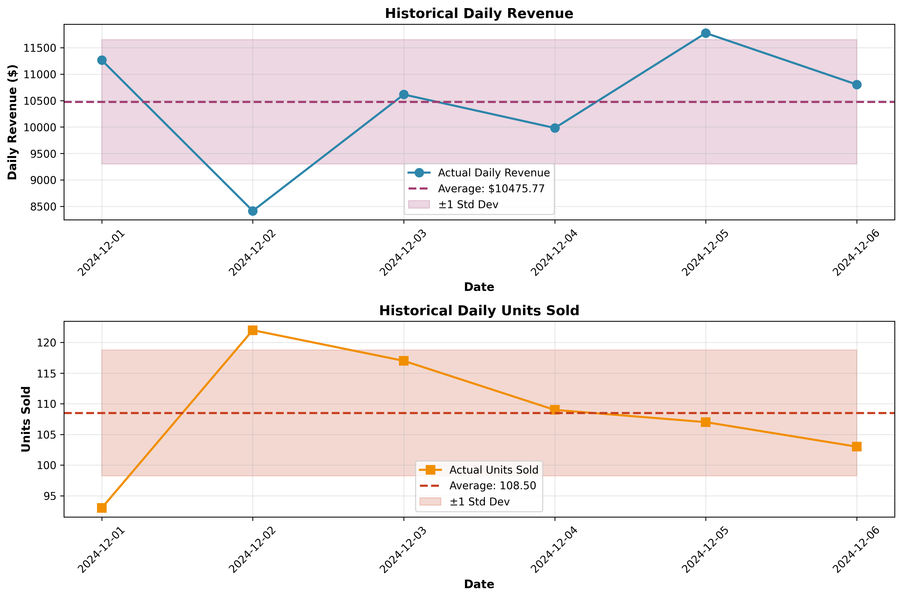
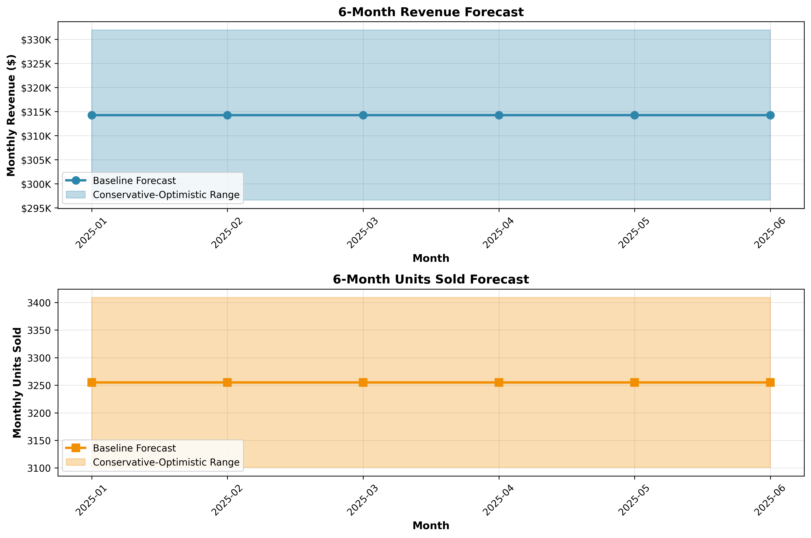

# Sales Forecast Report
## 6-Month Sales Projection (January 2025 - June 2025)

---

## Executive Summary

This report presents a 6-month sales forecast based on historical data from December 1-6, 2024. Due to the limited historical data available (6 days), the forecast employs a conservative methodology with multiple scenarios to account for uncertainty.

**Key Findings:**
- **Baseline Monthly Revenue Forecast:** $314,273.05
- **Baseline Monthly Units Forecast:** 3,255 units
- **6-Month Total Revenue (Baseline):** $1,885,638.30
- **6-Month Total Units (Baseline):** 19,530 units

---

## Methodology

### Data Overview
The analysis is based on daily sales data from **December 1-6, 2024**, containing:
- 6 data points (days)
- Daily revenue ranging from $8,415.66 to $11,775.37
- Daily units sold ranging from 93 to 122 units

### Historical Performance Metrics

| Metric | Value |
|--------|-------|
| Average Daily Revenue | $10,475.77 |
| Average Daily Units Sold | 108.50 |
| Revenue Standard Deviation | $1,176.79 |
| Units Standard Deviation | 10.27 |
| Revenue Trend | $204.13/day (not statistically significant) |
| Units Trend | -0.09/day (not statistically significant) |

### Forecasting Approach

Given the limited historical data, I employed a **multi-scenario approach** rather than relying on a single forecast:

#### 1. **Baseline Forecast (Most Likely)**
- Method: Simple average extrapolation
- Calculation: Daily average × 30 days per month
- Rationale: With only 6 days of data, the mean provides the most stable estimate
- **Monthly Revenue:** $314,273.05
- **Monthly Units:** 3,255

#### 2. **Conservative Forecast (Lower Bound)**
- Method: Average minus 0.5 standard deviations
- Calculation: (Daily average - 0.5 × std dev) × 30 days
- Rationale: Accounts for potential downside volatility
- **Monthly Revenue:** $296,621.16
- **Monthly Units:** 3,101

#### 3. **Optimistic Forecast (Upper Bound)**
- Method: Average plus 0.5 standard deviations
- Calculation: (Daily average + 0.5 × std dev) × 30 days
- Rationale: Accounts for potential upside performance
- **Monthly Revenue:** $331,924.94
- **Monthly Units:** 3,409

### Statistical Considerations

**Trend Analysis:**
- Linear regression analysis revealed a slight positive revenue trend ($204.13/day)
- However, with R² = 0.1053 and p-value = 0.5303, this trend is **not statistically significant**
- Units sold show virtually no trend (slope = -0.09, R² = 0.0002)
- Therefore, trend-based forecasting was deemed unreliable

**Limitations:**
- Small sample size (6 days) limits statistical confidence
- No seasonal patterns can be identified
- No year-over-year comparisons available
- Potential December holiday effects not captured
- External factors (marketing, competition, economic conditions) not included

---

## 6-Month Forecast Details

### Monthly Breakdown

| Month | Baseline Revenue | Conservative Revenue | Optimistic Revenue | Baseline Units | Conservative Units | Optimistic Units |
|-------|-----------------|---------------------|-------------------|----------------|-------------------|-----------------|
| 2025-01 | $314,273.05 | $296,621.16 | $331,924.94 | 3,255 | 3,101 | 3,409 |
| 2025-02 | $314,273.05 | $296,621.16 | $331,924.94 | 3,255 | 3,101 | 3,409 |
| 2025-03 | $314,273.05 | $296,621.16 | $331,924.94 | 3,255 | 3,101 | 3,409 |
| 2025-04 | $314,273.05 | $296,621.16 | $331,924.94 | 3,255 | 3,101 | 3,409 |
| 2025-05 | $314,273.05 | $296,621.16 | $331,924.94 | 3,255 | 3,101 | 3,409 |
| 2025-06 | $314,273.05 | $296,621.16 | $331,924.94 | 3,255 | 3,101 | 3,409 |
| **TOTAL** | **$1,885,638.30** | **$1,779,726.97** | **$1,991,549.63** | **19,530** | **18,606** | **20,454** |

### Forecast Range
- **Revenue Range:** $296,621 - $331,925 per month
- **Units Range:** 3,101 - 3,409 per month
- **Confidence Level:** Moderate (due to limited historical data)

---

## Visualizations

### Historical Sales Performance

The historical data shows:
- Revenue fluctuates around the mean of $10,475.77
- Units sold remain relatively stable around 108.5 units/day
- No clear trend pattern in the 6-day period

### 6-Month Forecast

The forecast visualization displays:
- Baseline (most likely) projection as the central line
- Shaded area representing the conservative-to-optimistic range
- Consistent monthly projections reflecting the stable historical pattern

---

## Recommendations

### 1. **Data Collection Priority**
- **Immediate Action:** Collect at least 3-6 months of historical data for more reliable forecasting
- Capture seasonal patterns, weekly cycles, and trend information
- Include external variables (marketing spend, promotions, holidays)

### 2. **Forecast Usage**
- Use the **baseline forecast** for planning purposes
- Maintain flexibility with the **conservative scenario** for risk management
- Consider the **optimistic scenario** for capacity planning

### 3. **Monitoring & Adjustment**
- Track actual vs. forecast performance weekly
- Update forecasts monthly as new data becomes available
- Investigate significant deviations (>15%) from baseline

### 4. **Business Planning**
- **Inventory Planning:** Stock for 3,255 units/month (baseline)
- **Revenue Planning:** Budget for $314,273/month with ±$18,000 variance
- **Cash Flow:** Expect $1.88M over 6 months (baseline scenario)

### 5. **Risk Mitigation**
- Prepare contingency plans for the conservative scenario ($297K/month)
- Build buffer inventory for potential optimistic scenario ($332K/month)
- Monitor early warning indicators (daily sales trends, customer inquiries)

---

## Conclusion

Based on 6 days of historical data (December 1-6, 2024), the **baseline forecast** projects:
- **Monthly revenue of $314,273** (range: $297K - $332K)
- **Monthly units of 3,255** (range: 3,101 - 3,409)
- **6-month total revenue of $1.89M** (range: $1.78M - $1.99M)

While this forecast provides a reasonable starting point, the **limited historical data** necessitates:
1. Conservative interpretation of results
2. Frequent monitoring and updates
3. Scenario planning for multiple outcomes
4. Urgent collection of additional historical data

As more data becomes available, forecasting accuracy will improve significantly, enabling more sophisticated techniques such as time series analysis, seasonal decomposition, and machine learning models.

---

**Report Generated:** 2026-05-31 16:05:03
**Data Period:** December 1-6, 2024
**Forecast Period:** January - June 2025
**Methodology:** Multi-scenario average-based forecasting
