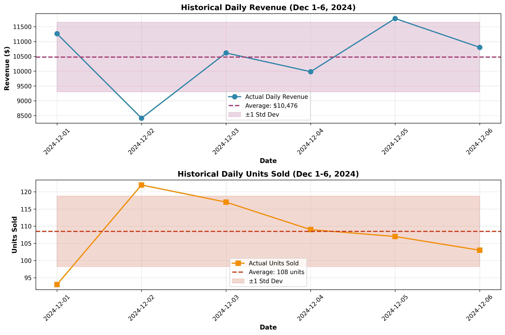
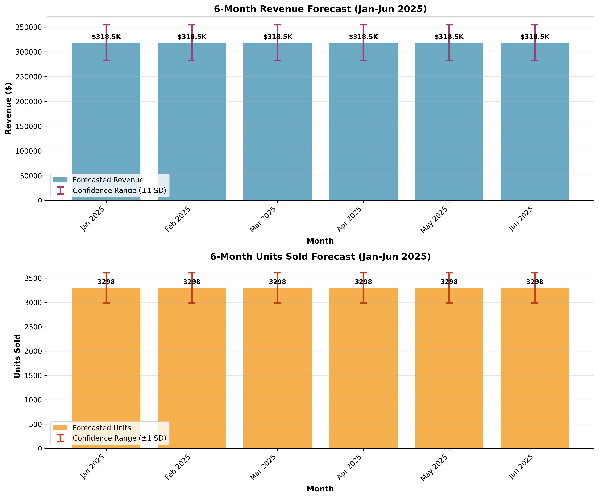
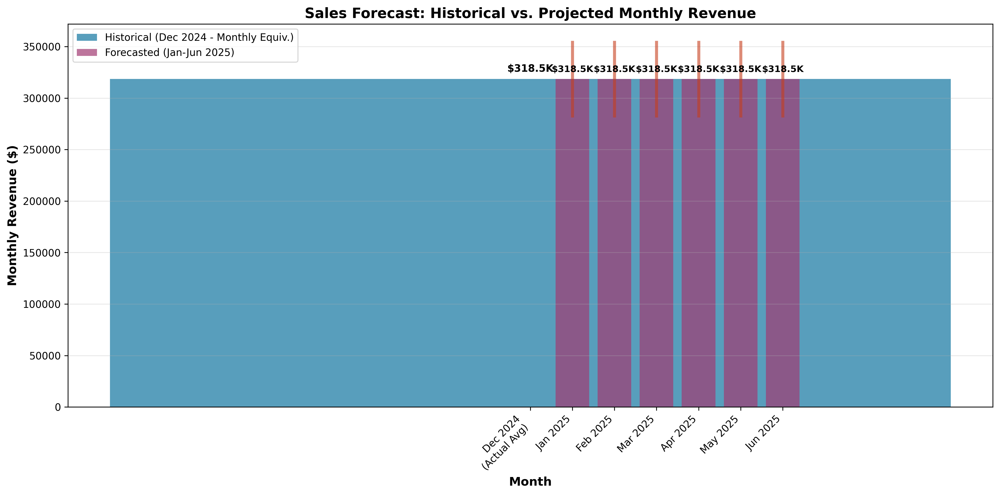

# Sales Forecast Report
## 6-Month Projection (January - June 2025)

**Report Generated:** May 31, 2026

---

## Executive Summary

Based on historical sales data from December 1-6, 2024, this report provides a 6-month sales forecast for January through June 2025. The forecast projects consistent monthly performance with appropriate confidence intervals to account for variability.

### Key Findings

- **Total Forecasted Revenue (6 months):** $1,910,780.14
- **Total Forecasted Units (6 months):** 19,790 units
- **Average Monthly Revenue:** $318,463.36
- **Average Monthly Units:** 3,298 units

---

## Methodology

### Data Overview

The analysis is based on **6 days** of historical sales data (December 1-6, 2024):

- **Date Range:** December 01, 2024 to December 06, 2024
- **Total Records:** 6 daily observations
- **Metrics Tracked:** Daily revenue and units sold

### Historical Performance

**Daily Averages:**
- Average Daily Revenue: $10,475.77
- Average Daily Units Sold: 108.50 units
- Revenue Standard Deviation: $1,176.79
- Units Standard Deviation: 10.27 units

**Trend Analysis:**
- Revenue Trend: +204.13 per day (R² = 0.1053)
- Units Trend: -0.09 per day (R² = 0.0002)

The low R² values indicate minimal linear trend in the limited data available, suggesting relatively stable daily performance.

### Forecasting Approach

Given the limited historical data (6 days), we employed a **conservative averaging methodology**:

1. **Base Forecast:** Calculated the mean daily revenue and units sold from historical data
2. **Monthly Projection:** Multiplied daily averages by 30.4 days (average days per month)
3. **Confidence Intervals:** Applied ±1 standard deviation to establish upper and lower bounds
4. **Assumption:** Consistent performance patterns continue into the forecast period

**Rationale:** With only 6 days of data, sophisticated time series models (ARIMA, exponential smoothing) would be prone to overfitting. A simple average-based approach provides a stable, interpretable baseline forecast.

---

## Detailed Monthly Forecast

### Revenue Forecast

| Month | Forecasted Revenue | Lower Bound (−1 SD) | Upper Bound (+1 SD) |
|-------|-------------------:|--------------------:|--------------------:|
| January 2025 | $318,463.36 | $282,688.86 | $354,237.85 |
| February 2025 | $318,463.36 | $282,688.86 | $354,237.85 |
| March 2025 | $318,463.36 | $282,688.86 | $354,237.85 |
| April 2025 | $318,463.36 | $282,688.86 | $354,237.85 |
| May 2025 | $318,463.36 | $282,688.86 | $354,237.85 |
| June 2025 | $318,463.36 | $282,688.86 | $354,237.85 |

### Units Sold Forecast

| Month | Forecasted Units | Lower Bound (−1 SD) | Upper Bound (+1 SD) |
|-------|------------------:|--------------------:|--------------------:|
| January 2025 | 3,298 | 2,986 | 3,611 |
| February 2025 | 3,298 | 2,986 | 3,611 |
| March 2025 | 3,298 | 2,986 | 3,611 |
| April 2025 | 3,298 | 2,986 | 3,611 |
| May 2025 | 3,298 | 2,986 | 3,611 |
| June 2025 | 3,298 | 2,986 | 3,611 |

---

## Visualizations

### 1. Historical Sales Performance

This chart shows the actual daily sales data for December 1-6, 2024, including:
- Daily revenue and units sold trends
- Average performance lines
- Variability bands (±1 standard deviation)

### 2. Monthly Forecast

This chart presents the 6-month forecast with:
- Projected monthly revenue and units
- Confidence intervals showing potential range of outcomes
- Consistent monthly projections based on historical averages

### 3. Historical vs. Forecast Comparison

This chart compares:
- December 2024 actual performance (converted to monthly equivalent)
- Projected performance for January-June 2025
- Visual representation of forecast consistency

---

## Assumptions and Limitations

### Assumptions
1. **Stable Market Conditions:** No major market disruptions or seasonal variations
2. **Consistent Operations:** Business operations remain similar to the historical period
3. **Average Month Length:** 30.4 days used for monthly calculations
4. **No Trend Extrapolation:** Given weak trends in limited data, we assume mean reversion

### Limitations
1. **Limited Historical Data:** Only 6 days of data limits forecast accuracy
2. **No Seasonality Analysis:** Insufficient data to identify seasonal patterns
3. **No External Factors:** Economic conditions, competition, and marketing efforts not modeled
4. **Short Observation Period:** December 1-6 may not represent typical business patterns

### Confidence Level
Given the limited data, these forecasts should be considered **preliminary estimates** with moderate confidence. The confidence intervals (±1 SD) suggest:
- **Revenue Range:** $282,688.86 to $354,237.85 per month
- **Units Range:** 2,986 to 3,611 units per month

---

## Recommendations

1. **Monitor Actual Performance:** Compare actual results against forecasts monthly to refine predictions
2. **Collect More Data:** Gather at least 3-6 months of historical data for more robust forecasting
3. **Identify Patterns:** Look for weekly, monthly, or seasonal patterns as more data becomes available
4. **Update Forecasts:** Revise forecasts monthly as new data becomes available
5. **Consider External Factors:** Incorporate marketing campaigns, economic indicators, and competitive actions
6. **Risk Planning:** Prepare for scenarios at both ends of the confidence interval

---

## Conclusion

Based on the available data from December 1-6, 2024, we forecast relatively stable monthly sales performance for the next 6 months:

- **Monthly Revenue:** Approximately $318,463.36
- **Monthly Units:** Approximately 3,298 units
- **6-Month Total Revenue:** $1,910,780.14
- **6-Month Total Units:** 19,790 units

While this forecast provides a reasonable baseline, it should be updated regularly as more historical data becomes available. The confidence intervals provide a range of likely outcomes, helping with scenario planning and resource allocation.

---

**Note:** This forecast is based on limited historical data and should be used as a preliminary planning tool. Regular updates and validation against actual performance are essential for maintaining forecast accuracy.
