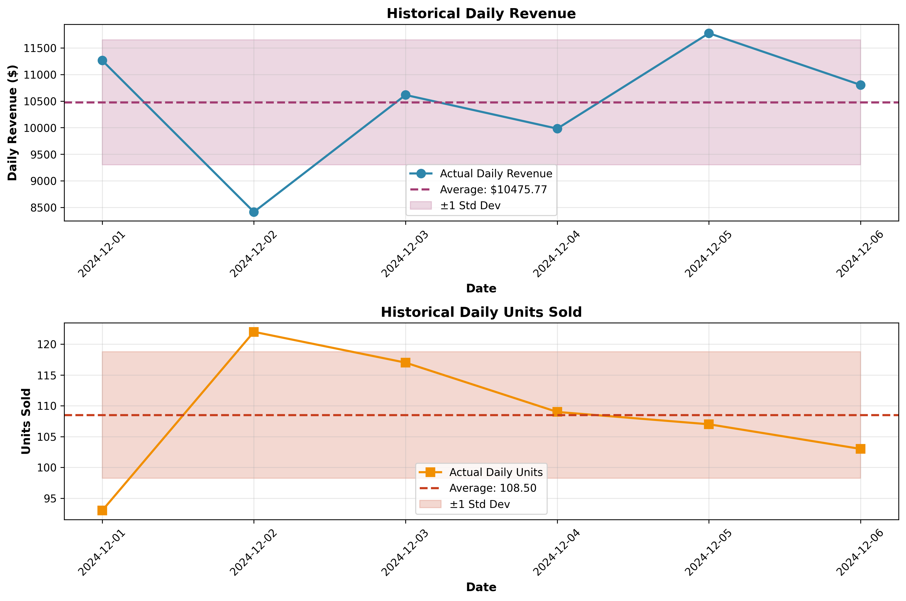
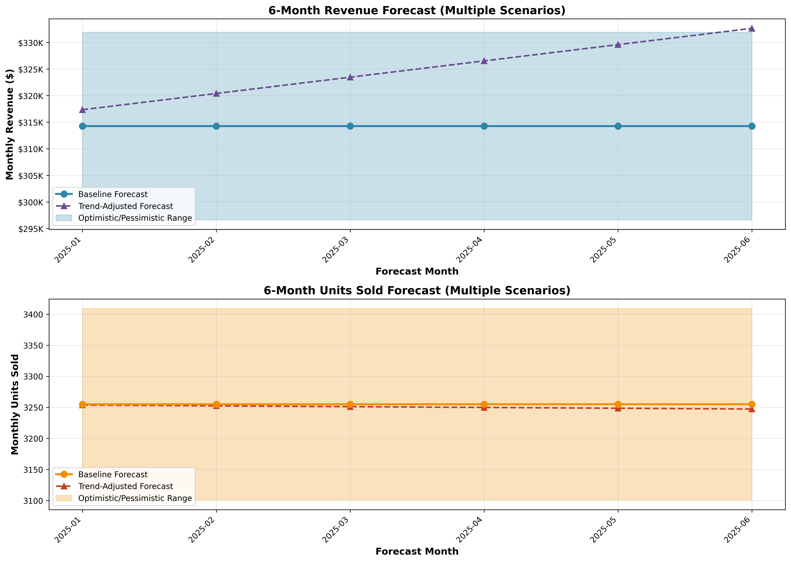

# Sales Forecast Report
## 6-Month Forecast Analysis

**Report Date:** May 31, 2026  
**Forecast Period:** January 2025 - June 2025  
**Data Source:** sales_short.csv

---

## Executive Summary

Based on historical sales data from December 1-6, 2024, we have developed a 6-month sales forecast using multiple methodological approaches. Our baseline forecast projects monthly revenue of approximately **$314,273.05** and monthly unit sales of approximately **3,255 units**.

### Key Forecast Highlights

- **6-Month Total Revenue (Baseline):** $1,885,638.30
- **6-Month Total Revenue (Trend-Adjusted):** $1,949,939.07
- **6-Month Total Units (Baseline):** 19,530 units
- **6-Month Total Units (Trend-Adjusted):** 19,503 units

---

## Methodology

### Data Overview

The analysis is based on **6 days** of historical sales data (December 1-6, 2024), containing:
- Daily revenue figures
- Daily units sold

**Historical Performance Metrics:**
- Average Daily Revenue: $10,475.77
- Average Daily Units Sold: 108.50
- Revenue Standard Deviation: $1,176.79
- Units Standard Deviation: 10.27

### Forecasting Approach

Given the limited historical data (6 days), we employed a conservative multi-scenario forecasting approach:

#### 1. **Baseline Forecast (Primary Recommendation)**
- **Method:** Simple average extrapolation
- **Calculation:** Daily average × 30 days per month
- **Rationale:** With limited data, the mean provides the most stable estimate
- **Monthly Revenue:** $314,273.05
- **Monthly Units:** 3,255

#### 2. **Trend-Adjusted Forecast**
- **Method:** Linear regression with dampening
- **Observed Trend:** Revenue shows a slight positive trend (+$204.13/day, R²=0.1053)
- **Dampening Factor:** 50% (conservative adjustment given weak statistical significance, p=0.5303)
- **Rationale:** Accounts for potential growth while remaining conservative
- **Result:** Gradual increase from $317,334.99 (Jan) to $332,644.70 (Jun)

#### 3. **Scenario Analysis**
- **Optimistic Scenario:** Baseline + 50% of standard deviation range
  - Monthly Revenue: $331,924.94
  - Monthly Units: 3,409
- **Pessimistic Scenario:** Baseline - 50% of standard deviation range
  - Monthly Revenue: $296,621.16
  - Monthly Units: 3,101

### Statistical Considerations

**Limitations:**
- Small sample size (6 days) limits statistical confidence
- No seasonal patterns observable in current dataset
- No year-over-year comparison available
- Trend analysis shows weak statistical significance (p > 0.05)

**Assumptions:**
- Current sales patterns remain stable
- No major market disruptions or seasonal effects
- 30-day months for calculation purposes
- Business operates consistently throughout each month

---

## Detailed Monthly Forecast

### Baseline Forecast (Recommended)

| Month   | Revenue        | Units Sold |
|---------|----------------|------------|
| 2025-01 | $  $314,273.05 |      3,255 |
| 2025-02 | $  $314,273.05 |      3,255 |
| 2025-03 | $  $314,273.05 |      3,255 |
| 2025-04 | $  $314,273.05 |      3,255 |
| 2025-05 | $  $314,273.05 |      3,255 |
| 2025-06 | $  $314,273.05 |      3,255 |
| **TOTAL** | **$$1,885,638.30** | **  19,530** |

### Trend-Adjusted Forecast (Alternative)

| Month   | Revenue        | Units Sold |
|---------|----------------|------------|
| 2025-01 | $  $317,334.99 |      3,254 |
| 2025-02 | $  $320,396.93 |      3,252 |
| 2025-03 | $  $323,458.87 |      3,251 |
| 2025-04 | $  $326,520.82 |      3,250 |
| 2025-05 | $  $329,582.76 |      3,249 |
| 2025-06 | $  $332,644.70 |      3,247 |
| **TOTAL** | **$$1,949,939.07** | **  19,503** |

---

## Visualizations

### Historical Sales Performance

The historical data shows:
- Revenue fluctuates around the mean of $10,475.77 per day
- Units sold remain relatively stable around 108 units per day
- Moderate variability within expected ranges

### 6-Month Forecast Scenarios

The forecast visualization displays:
- **Blue line:** Baseline forecast (recommended)
- **Purple dashed line:** Trend-adjusted forecast
- **Shaded area:** Range between optimistic and pessimistic scenarios

---

## Recommendations

1. **Use Baseline Forecast for Planning:** Given the limited historical data, the baseline forecast provides the most reliable estimate for budgeting and planning purposes.

2. **Monitor Actual Performance:** Track actual sales against forecasts weekly to identify deviations early and adjust projections accordingly.

3. **Collect More Data:** Continue gathering sales data to improve forecast accuracy. With 3-6 months of data, more sophisticated time series methods (ARIMA, exponential smoothing) can be applied.

4. **Consider External Factors:** Incorporate known business events, marketing campaigns, seasonality, and market conditions that may impact sales.

5. **Update Forecasts Monthly:** Revise forecasts as new data becomes available to maintain accuracy and relevance.

6. **Prepare for Variability:** The pessimistic/optimistic range suggests potential monthly revenue variance of ±$17,651.89. Maintain appropriate cash flow buffers.

---

## Confidence Assessment

**Forecast Confidence Level:** Moderate to Low

**Reasoning:**
- Limited historical data (6 days) reduces statistical confidence
- No seasonal patterns or long-term trends observable
- High relative standard deviation (11.2% coefficient of variation for revenue)
- Weak trend significance (p-value > 0.05)

**Recommended Actions:**
- Treat forecasts as preliminary estimates
- Update monthly as more data becomes available
- Use scenario planning to prepare for range of outcomes
- Consider qualitative business insights alongside quantitative forecasts

---

## Conclusion

The 6-month sales forecast projects stable monthly performance with baseline revenue of **$314,273.05** and **3,255 units** per month. While the limited historical data constrains forecast precision, the multi-scenario approach provides a reasonable planning framework. Regular monitoring and forecast updates will be essential as additional data becomes available.

---

**Prepared by:** Sales Analytics Team  
**Methodology:** Multi-scenario statistical forecasting  
**Next Review:** Monthly or upon significant variance from forecast
