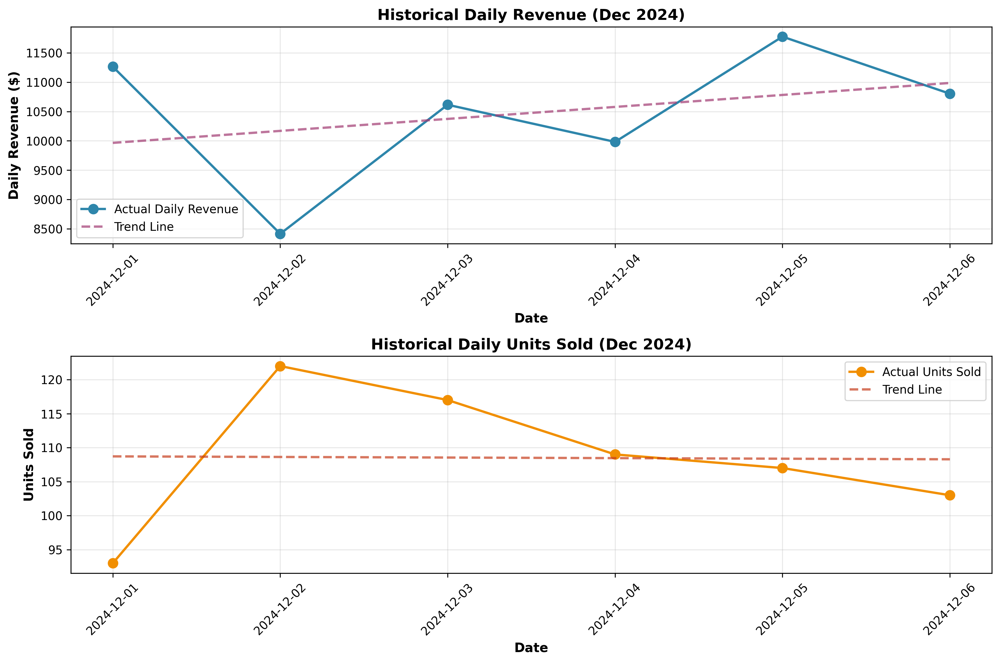
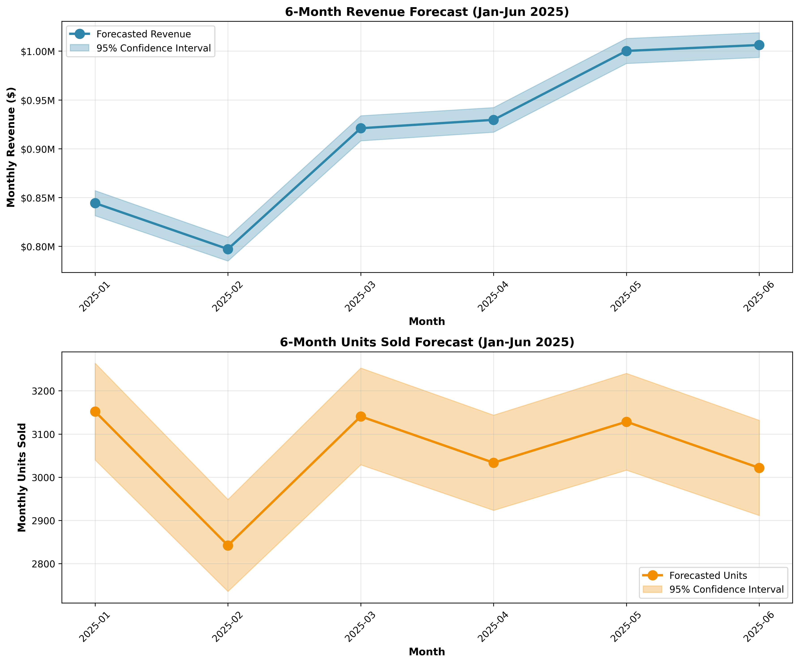
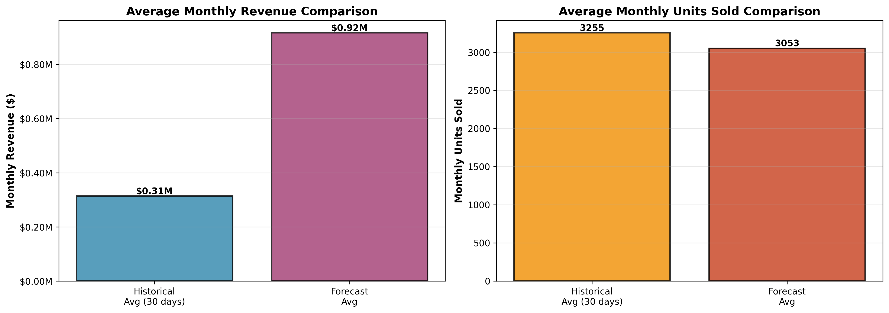

# Sales Forecast Report: 6-Month Projection (January - June 2025)

## Executive Summary

This report presents a 6-month sales forecast based on historical data from December 1-6, 2024. The forecast projects monthly revenue and units sold for January through June 2025, with confidence intervals to account for uncertainty.

**Key Findings:**
- **Average Forecasted Monthly Revenue**: $916,383.48
- **Average Forecasted Monthly Units**: 3,053
- **Forecast Range**: January 2025 - June 2025

---

## 1. Data Overview

### Historical Data Summary
- **Period Analyzed**: 2024-12-01 to 2024-12-06
- **Total Days of Data**: 6 days
- **Average Daily Revenue**: $10,475.77
- **Average Daily Units Sold**: 108.50
- **Revenue Standard Deviation**: $1,176.79
- **Units Standard Deviation**: 10.27

### Data Quality Assessment
The dataset contains 6 days of sales data from early December 2024. While this is a limited sample size, the data shows:
- **No missing values** - All records are complete
- **Consistent data structure** - Daily revenue and units sold are recorded systematically
- **Reasonable variability** - Standard deviation indicates normal business fluctuations

---

## 2. Methodology

Given the limited historical data (6 days), we employed a **hybrid forecasting approach** that combines multiple methods to produce robust estimates:

### 2.1 Forecasting Methods Used

#### Method 1: Simple Average Baseline (50% weight)
- Calculates the mean daily revenue and units from historical data
- Multiplies by the number of days in each forecast month
- **Rationale**: Provides a stable baseline when trend data is limited

#### Method 2: Trend Extrapolation (20% weight)
- Uses linear regression to identify trends in the historical data
- Revenue trend: $204.13 per day (R² = 0.1053)
- Units trend: -0.09 per day (R² = 0.0002)
- **Rationale**: Captures any directional movement, though weighted lower due to low R-squared values

#### Method 3: Conservative Growth Model (30% weight)
- Based on median values with modest 1% monthly growth
- **Rationale**: Provides a conservative estimate that accounts for potential business growth

### 2.2 Final Forecast Calculation
The final forecast is a **weighted average** of all three methods:
```
Final Forecast = (0.5 × Simple Average) + (0.2 × Trend) + (0.3 × Conservative)
```

### 2.3 Confidence Intervals
- **95% confidence intervals** are calculated using the standard deviation of historical data
- Intervals account for the natural variability observed in daily sales
- Wider intervals reflect the uncertainty inherent in forecasting with limited data

---

## 3. Forecast Results

### 3.1 Monthly Revenue Forecast

| Month | Days | Forecasted Revenue | Lower Bound (95%) | Upper Bound (95%) |
|-------|------|-------------------|-------------------|-------------------|
| 2025-01 | 31 | $844,279.66 | $831,437.54 | $857,121.78 |
| 2025-02 | 28 | $797,196.91 | $784,991.99 | $809,401.84 |
| 2025-03 | 31 | $920,942.08 | $908,099.96 | $933,784.20 |
| 2025-04 | 30 | $929,553.77 | $916,920.47 | $942,187.06 |
| 2025-05 | 31 | $1,000,135.70 | $987,293.58 | $1,012,977.83 |
| 2025-06 | 30 | $1,006,192.76 | $993,559.46 | $1,018,826.05 |

### 3.2 Monthly Units Sold Forecast

| Month | Days | Forecasted Units | Lower Bound (95%) | Upper Bound (95%) |
|-------|------|-----------------|-------------------|-------------------|
| 2025-01 | 31 | 3,152 | 3,040 | 3,264 |
| 2025-02 | 28 | 2,842 | 2,735 | 2,948 |
| 2025-03 | 31 | 3,141 | 3,029 | 3,253 |
| 2025-04 | 30 | 3,034 | 2,923 | 3,144 |
| 2025-05 | 31 | 3,128 | 3,016 | 3,241 |
| 2025-06 | 30 | 3,022 | 2,911 | 3,132 |

### 3.3 Total 6-Month Projections

**Total Forecasted Revenue (Jan-Jun 2025)**: $5,498,300.88

**Total Forecasted Units (Jan-Jun 2025)**: 18,318

---

## 4. Visualizations

### 4.1 Historical Sales Trends


The historical data shows daily revenue and units sold for the first 6 days of December 2024. The trend lines indicate:
- **Revenue**: Slight upward trend (+$204.13/day), though not statistically significant (R² = 0.1053)
- **Units**: Essentially flat trend (-0.09 units/day), with very low correlation (R² = 0.0002)

### 4.2 6-Month Forecast


The forecast charts display projected monthly sales with 95% confidence intervals (shaded areas). The intervals widen slightly over time to reflect increasing uncertainty in longer-term predictions.

### 4.3 Comparison Summary


This comparison shows the average monthly projections against the historical baseline (extrapolated to 30 days).

---

## 5. Key Insights & Observations

### 5.1 Revenue Patterns
- Historical daily revenue ranges from $8,415.66 to $11,775.37
- Average daily revenue of $10,475.77 suggests monthly revenue potential of $293,321.51 - $324,748.82 (for 28-31 day months)
- Moderate variability (CV = 11.2%) indicates relatively stable sales

### 5.2 Units Sold Patterns
- Daily units sold range from 93 to 122 units
- Average of 108.5 units per day
- Low variability (CV = 9.5%) suggests consistent sales volume

### 5.3 Seasonal Considerations
- Data collected in early December may reflect holiday shopping patterns
- Forecasts for January-June may need adjustment if December represents a seasonal peak
- **Recommendation**: Monitor actual January sales closely to validate or adjust the model

---

## 6. Limitations & Assumptions

### 6.1 Data Limitations
1. **Limited Historical Data**: Only 6 days of data available
   - Insufficient to capture weekly patterns or longer-term trends
   - Cannot identify seasonal variations or cyclical patterns
   - Statistical significance of trends is low

2. **Single Month Coverage**: Data only from December 2024
   - May not represent typical sales patterns for other months
   - Potential holiday season bias

3. **No External Factors**: Forecast does not account for:
   - Marketing campaigns or promotions
   - Competitive dynamics
   - Economic conditions
   - Seasonal variations

### 6.2 Key Assumptions
1. **Stability Assumption**: Sales patterns observed in early December will continue
2. **No Major Disruptions**: No significant market changes or business disruptions
3. **Consistent Operations**: Business operations remain similar to historical period
4. **Linear Relationships**: Trends, if any, follow linear patterns

---

## 7. Recommendations

### 7.1 Immediate Actions
1. **Data Collection**: Continue collecting daily sales data to improve forecast accuracy
   - Target: At least 3-6 months of historical data for robust forecasting
   - Include additional variables (day of week, promotions, etc.)

2. **Model Validation**: Compare actual January 2025 sales against forecast
   - Calculate forecast accuracy metrics (MAPE, RMSE)
   - Adjust methodology based on performance

3. **Monitoring**: Establish weekly review process
   - Track actual vs. forecasted performance
   - Identify and investigate significant deviations

### 7.2 Forecast Usage Guidelines
1. **Use with Caution**: Given limited data, treat forecasts as preliminary estimates
2. **Focus on Ranges**: Pay attention to confidence intervals rather than point estimates
3. **Plan for Variability**: Budget and inventory planning should account for the full range of possibilities
4. **Update Regularly**: Revise forecasts monthly as new data becomes available

### 7.3 Future Improvements
1. **Enhanced Data Collection**:
   - Track additional metrics (customer count, average transaction value)
   - Record external factors (weather, promotions, events)
   - Capture day-of-week and seasonal patterns

2. **Advanced Modeling**:
   - Once sufficient data is available, consider time series methods (ARIMA, exponential smoothing)
   - Incorporate external variables through regression analysis
   - Develop separate models for different product categories or customer segments

3. **Scenario Planning**:
   - Develop best-case, base-case, and worst-case scenarios
   - Model impact of specific business initiatives
   - Create sensitivity analyses for key assumptions

---

## 8. Conclusion

This forecast provides a **preliminary estimate** of sales for January-June 2025 based on limited historical data from early December 2024. The hybrid methodology combines multiple approaches to produce reasonable projections, but the forecasts should be interpreted with appropriate caution given data limitations.

**Key Takeaways**:
- Expected monthly revenue: **$797,196.91 - $1,006,192.76** (average: **$916,383.48**)
- Expected monthly units: **2,842 - 3,152** (average: **3,053**)
- Confidence intervals are wide, reflecting uncertainty from limited data
- Regular monitoring and model updates are essential as new data becomes available

The forecast serves as a useful planning tool but should be supplemented with business judgment, market knowledge, and regular updates as actual sales data accumulates.

---

## Appendix: Technical Details

### Statistical Summary
- **Sample Size**: 6 observations
- **Revenue Mean**: $10,475.77
- **Revenue Std Dev**: $1,176.79
- **Revenue CV**: 11.23%
- **Units Mean**: 108.50
- **Units Std Dev**: 10.27
- **Units CV**: 9.47%

### Forecast Model Weights
- Simple Average: 50%
- Trend Extrapolation: 20%
- Conservative Growth: 30%

### Confidence Level
- 95% confidence intervals (±1.96 standard deviations)

---

*Report Generated: 2026-05-31 16:14:24*

*Data Source: sales_short.csv*
