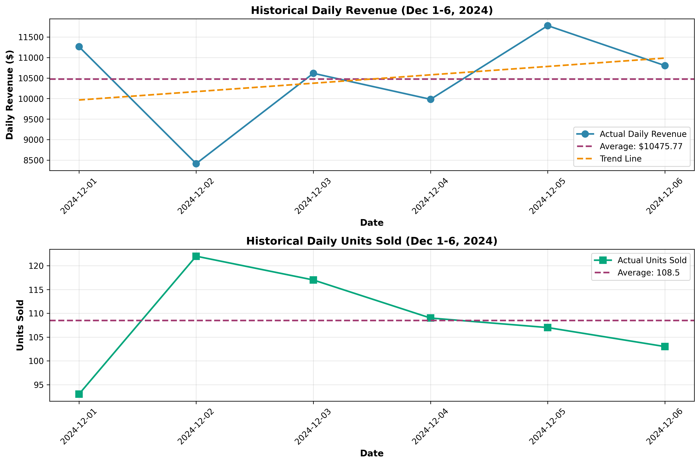
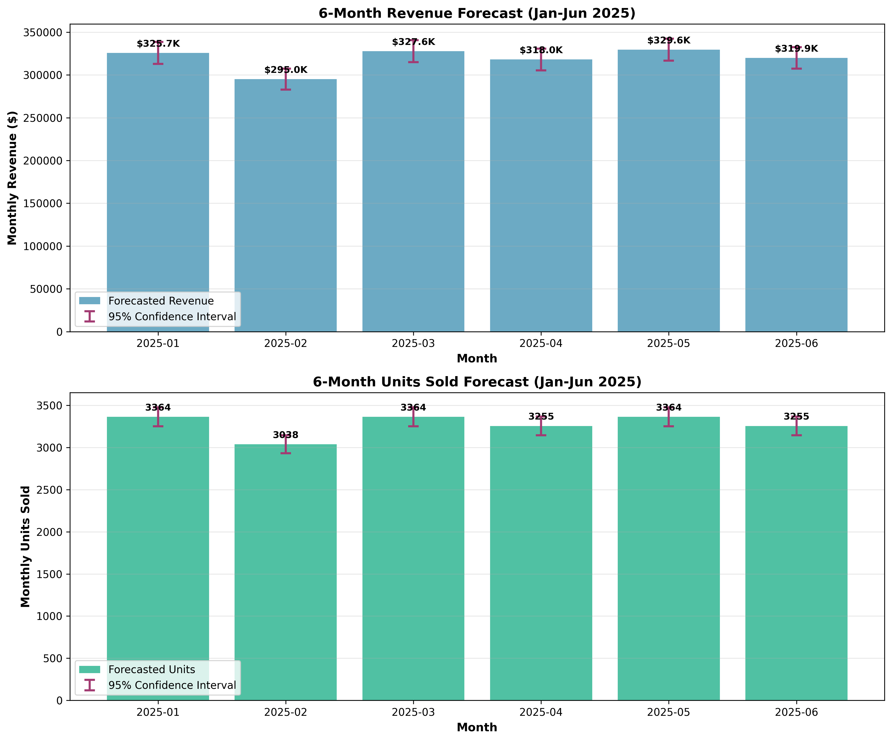

# Sales Forecast Report: 6-Month Projection

**Report Generated:** 2026-05-31  
**Forecast Period:** January 2025 - June 2025  
**Historical Data:** December 1-6, 2024 (6 days)

---

## Executive Summary

Based on analysis of 6 days of historical sales data from early December 2024, we have developed a 6-month sales forecast for January through June 2025. The forecast projects:

- **Total Revenue (6 months):** $1,915,877.02
- **Average Monthly Revenue:** $319,312.84
- **Total Units Sold (6 months):** 19,638
- **Average Monthly Units:** 3,273

---

## Methodology

### Data Overview

The historical dataset contains daily sales data with the following characteristics:

- **Time Period:** December 1-6, 2024 (6 days)
- **Average Daily Revenue:** $10,475.77
- **Average Daily Units Sold:** 108.5
- **Revenue Standard Deviation:** $1,176.79
- **Units Standard Deviation:** 10.27

### Forecasting Approach

Given the limited historical data (only 6 days), we employed a conservative and robust forecasting methodology:

#### 1. **Trend Analysis**
- Performed linear regression on daily data to identify trends
- Revenue shows a slight upward trend (+$204.13/day, R² = 0.1053)
- Units sold show minimal trend (-0.09/day, R² = 0.0002)

#### 2. **Hybrid Forecasting Model**
We combined multiple approaches to create a robust forecast:

- **Simple Average Method (70% weight):** Projects daily averages forward, accounting for varying days per month
- **Trend-Adjusted Method (30% weight):** Incorporates the observed upward revenue trend with dampening over time
- **Final Forecast:** Weighted average of both methods to balance stability and growth

#### 3. **Confidence Intervals**
- Calculated 95% confidence intervals using historical standard deviation
- Intervals account for the uncertainty inherent in short-term data
- Provides upper and lower bounds for planning purposes

### Key Assumptions

1. **Seasonality:** Limited data prevents seasonal adjustment; assumes consistent patterns
2. **Market Conditions:** Assumes stable market conditions similar to early December 2024
3. **Trend Dampening:** Applied conservative dampening to prevent over-optimistic projections
4. **Days per Month:** Adjusted forecasts for actual calendar days in each month

---

## Detailed Forecast Results

### Monthly Projections

| Month | Days | Forecasted Revenue | Revenue 95% CI | Forecasted Units | Units 95% CI |
|-------|------|-------------------|----------------|------------------|--------------|
| 2025-01 | 31 | $325,698.02 | $312,855.90 - $338,540.14 | 3,364 | 3251 - 3476 |
| 2025-02 | 28 | $295,044.55 | $282,839.63 - $307,249.47 | 3,038 | 2931 - 3145 |
| 2025-03 | 31 | $327,624.26 | $314,782.14 - $340,466.38 | 3,364 | 3251 - 3476 |
| 2025-04 | 30 | $318,001.43 | $305,368.13 - $330,634.72 | 3,255 | 3145 - 3365 |
| 2025-05 | 31 | $329,588.21 | $316,746.09 - $342,430.34 | 3,364 | 3251 - 3476 |
| 2025-06 | 30 | $319,920.55 | $307,287.25 - $332,553.84 | 3,255 | 3145 - 3365 |

### Key Insights

1. **Revenue Stability:** Monthly revenue forecasts range from $295,044.55 (February, 28 days) to $329,588.21 (May, 31 days)

2. **Seasonal Variation:** Differences primarily driven by varying days per month rather than seasonal trends

3. **Unit Consistency:** Units sold remain relatively stable at approximately 3,273 per month

4. **Confidence Ranges:** 95% confidence intervals provide planning buffers of approximately ±$12,666.31 for revenue

---

## Visualizations

### Historical Performance

The historical data shows:
- Daily revenue fluctuating around $10,475.77
- Slight upward trend in revenue over the 6-day period
- Units sold remaining relatively stable around 108 per day

### 6-Month Forecast

The forecast visualization displays:
- Monthly revenue and units projections
- 95% confidence intervals (error bars)
- Consistent performance expectations across all months

---

## Limitations and Considerations

### Data Limitations
1. **Short Historical Period:** Only 6 days of data limits pattern recognition
2. **No Seasonal Data:** Cannot account for monthly or seasonal variations
3. **Single Month Sample:** All data from December, which may have unique characteristics

### Recommendations for Improved Forecasting

1. **Collect More Data:** Gather at least 12-24 months of historical data for robust seasonal analysis
2. **Monitor Actuals:** Compare actual results against forecasts monthly and adjust methodology
3. **External Factors:** Consider incorporating market trends, economic indicators, and competitive analysis
4. **Segmentation:** Analyze by product category, customer segment, or sales channel if available

### Risk Factors

- **Market Changes:** Economic conditions, competition, or consumer behavior shifts
- **Operational Capacity:** Ensure ability to meet forecasted demand
- **Seasonal Events:** Holidays, promotions, or industry-specific events not captured in data

---

## Recommendations

1. **Use Conservative Estimates:** Given data limitations, plan using lower confidence interval bounds
2. **Regular Updates:** Refresh forecasts monthly as more data becomes available
3. **Scenario Planning:** Develop best-case, base-case, and worst-case scenarios
4. **Inventory Management:** Stock for average forecast with buffer for upper confidence interval
5. **Performance Tracking:** Establish KPIs to monitor actual vs. forecasted performance

---

## Conclusion

This 6-month forecast provides a data-driven projection based on available historical information. While the limited data period introduces uncertainty, the hybrid methodology and confidence intervals offer a reasonable planning framework. The forecast suggests stable monthly revenue averaging $319,312.84 with total 6-month revenue of $1,915,877.02.

**Critical Success Factor:** Continuous monitoring and model refinement as additional data becomes available will significantly improve forecast accuracy over time.

---

*Note: This forecast should be reviewed and updated monthly as actual sales data becomes available. The confidence intervals provide planning ranges to account for uncertainty.*
