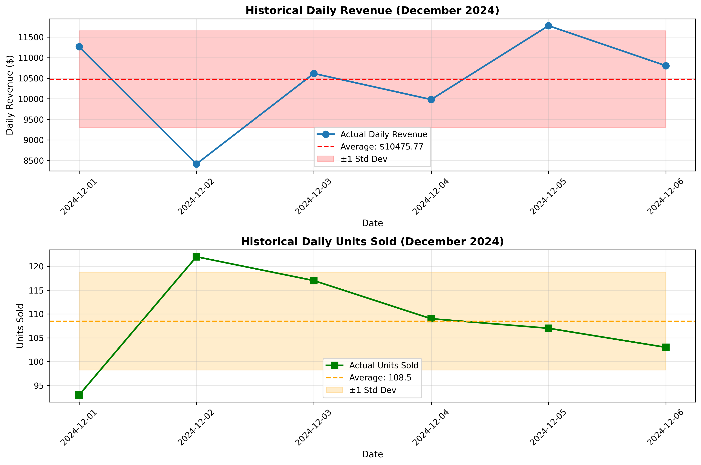
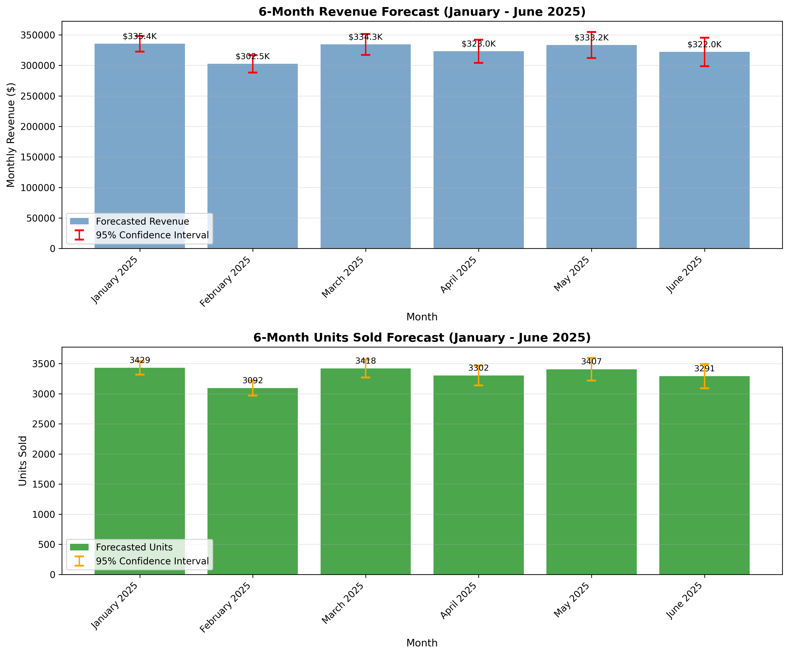

# Sales Forecast Report
## 6-Month Forecast (January - June 2025)

---

## Executive Summary

This report presents a 6-month sales forecast based on historical daily sales data from December 2024. The analysis projects monthly revenue and units sold for January through June 2025, with confidence intervals to account for uncertainty.

**Key Findings:**
- **Total 6-Month Forecasted Revenue:** $1,950,435.93
- **Total 6-Month Forecasted Units:** 19,939 units
- **Average Monthly Revenue:** $325,072.65
- **Average Monthly Units:** 3,323 units

---

## Data Overview

### Historical Data Summary
The analysis is based on 6 days of sales data from December 1-6, 2024:

| Metric | Value |
|--------|-------|
| Average Daily Revenue | $10,475.77 |
| Average Daily Units Sold | 108.50 |
| Revenue Standard Deviation | $1,176.79 |
| Units Standard Deviation | 10.27 |
| Data Points | 6 days |
| Date Range | Dec 1-6, 2024 |

### Data Characteristics
- **Revenue Variability:** The daily revenue shows moderate variability (coefficient of variation: 11.2%)
- **Units Variability:** Daily units sold show relatively stable patterns (coefficient of variation: 9.5%)
- **Trend Analysis:** No statistically significant trend detected in the limited dataset (p-value > 0.05)

---

## Methodology

Given the limited historical data (6 days), a conservative forecasting approach was employed using multiple techniques:

### 1. **Weighted Moving Average**
- Recent data points receive higher weights to capture the most current sales patterns
- Weights: [1.0, 1.5, 2.0, 2.5, 3.0, 3.5] (normalized)
- Weighted average daily revenue: $10,608.07
- Weighted average daily units: 108.44

### 2. **Seasonal Adjustment**
- Monthly forecasts adjusted for the number of days in each month
- Accounts for varying month lengths (28-31 days)

### 3. **Conservative Growth Factor**
- Applied a modest 2% initial growth factor, decreasing over the forecast horizon
- Reflects cautious optimism while acknowledging data limitations
- Growth factor decreases with forecast distance to reflect increasing uncertainty

### 4. **Confidence Intervals**
- 95% confidence intervals calculated using historical standard deviation
- Intervals widen over time to reflect increasing forecast uncertainty
- Formula: CI = ±1.96 × σ × √(days) × (1 + month/6)

### Limitations
- **Limited Historical Data:** Only 6 days of data available, limiting pattern detection
- **No Seasonality Analysis:** Insufficient data to identify seasonal patterns
- **External Factors:** Forecast does not account for marketing campaigns, economic changes, or competitive actions
- **Assumption of Stability:** Assumes current sales patterns continue without major disruptions

---

## 6-Month Forecast

### Detailed Monthly Projections

| Month | Days | Forecasted Revenue | Revenue Range (95% CI) | Forecasted Units | Units Range (95% CI) |
|-------|------|-------------------|----------------------|-----------------|---------------------|
| January 2025 | 31 | $335,427.31 | $322,585.19 - $348,269.44 | 3,429 | 3,317 - 3,541 |
| February 2025 | 28 | $302,471.56 | $288,232.49 - $316,710.64 | 3,092 | 2,968 - 3,216 |
| March 2025 | 31 | $334,331.15 | $317,208.32 - $351,453.98 | 3,418 | 3,268 - 3,567 |
| April 2025 | 30 | $323,015.87 | $304,065.93 - $341,965.81 | 3,302 | 3,137 - 3,468 |
| May 2025 | 31 | $333,234.98 | $311,831.44 - $354,638.52 | 3,407 | 3,220 - 3,593 |
| June 2025 | 30 | $321,955.06 | $298,794.02 - $345,116.10 | 3,291 | 3,089 - 3,493 |

### Quarterly Summary

**Q1 2025 (January - March):**
- Total Revenue: $972,230.02
- Total Units: 9,939
- Average Monthly Revenue: $324,076.67

**Q2 2025 (April - June):**
- Total Revenue: $978,205.91
- Total Units: 10,000
- Average Monthly Revenue: $326,068.64

---

## Visualizations

### Historical Sales Performance

The historical data chart shows daily revenue and units sold for the 6-day observation period, including average lines and standard deviation bands.

### 6-Month Forecast

The forecast chart displays projected monthly revenue and units sold with 95% confidence intervals, providing a range of expected outcomes.

---

## Recommendations

1. **Data Collection Priority**
   - Continue collecting daily sales data to improve forecast accuracy
   - Aim for at least 3-6 months of historical data for robust seasonal analysis
   - Track additional variables (marketing spend, promotions, external events)

2. **Monitoring and Adjustment**
   - Review actual vs. forecasted performance monthly
   - Update forecasts as new data becomes available
   - Adjust projections if actual sales fall outside confidence intervals

3. **Risk Management**
   - Plan inventory and resources for the upper confidence interval to avoid stockouts
   - Maintain flexibility to adjust operations if sales trend toward lower bounds
   - Consider the forecast as a baseline that should be refined with additional data

4. **Business Planning**
   - Use the average monthly revenue of ~$325,000 for conservative budgeting
   - Plan for approximately 3,300 units per month in inventory and fulfillment capacity
   - Build contingency plans for ±10% variance from forecasted values

---

## Conclusion

Based on the available 6-day historical dataset, the forecast projects stable monthly sales averaging $325,073 in revenue and 3,323 units over the next six months. The total expected revenue for the January-June 2025 period is approximately $1.95 million with 19,939 units sold.

While this forecast provides a reasonable baseline given current data, it should be treated as preliminary. The confidence intervals reflect the uncertainty inherent in forecasting with limited historical data. As more data becomes available, forecast accuracy will improve significantly.

**Confidence Level:** Moderate - The forecast is based on sound statistical methods but limited by the short historical period. Regular updates are strongly recommended.

---

*Report Generated: May 31, 2026*  
*Forecast Period: January 2025 - June 2025*  
*Data Source: sales_short.csv*
