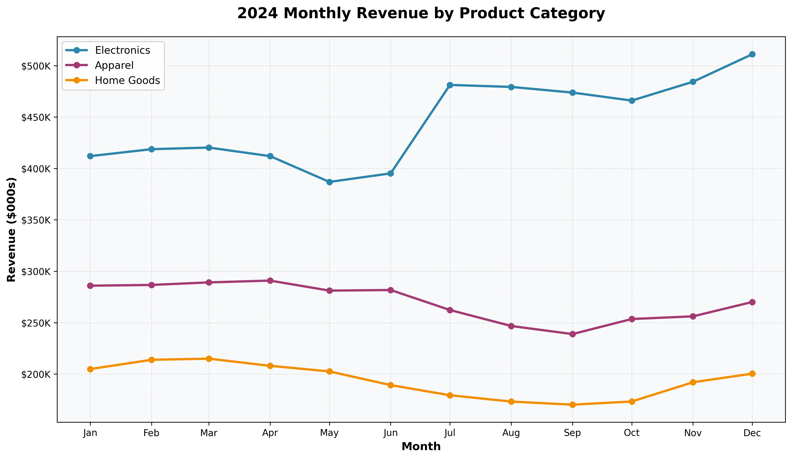

# 2024 Sales Performance Report

## Executive Summary

Our business generated **$10.9 million** in revenue this year, with strong momentum building in the second half. While overall performance was solid, a closer look reveals important shifts in our product mix that require immediate attention.

---

## Key Findings

### 1. Electronics is Driving Our Growth — But We're Losing Ground in Apparel

The story of 2024 is really a tale of two businesses:

- **Electronics revenue surged 18%** in the second half of the year compared to the first half, now representing nearly half (49%) of our total revenue
- **Apparel sales declined 11%** over the same period, dropping from our second-largest category to a concerning downward trend
- **Home Goods also fell 12%**, suggesting broader challenges beyond just one category

This shift is clearly visible in the chart below. While Electronics climbed steadily throughout the year and finished strong in December, both Apparel and Home Goods trended downward after mid-year.

### 2. Strong Finish to the Year Shows Positive Momentum

Despite mid-year softness, we ended 2024 on a high note:

- **December was our best month ever** at $982K in revenue — 9% above our monthly average
- **Q4 revenue grew 4% over Q3**, driven primarily by Electronics performance
- The holiday season demonstrated that when we execute well, customers respond

### 3. The West Region Continues to Outperform

Geographic performance remains uneven:

- **West region accounts for 31% of total revenue** — more than any other region
- North region lags at just 21% of revenue, suggesting untapped potential or market challenges
- This concentration creates both opportunity and risk for our business

---

## Recommendation for Next Quarter

**Focus on revitalizing the Apparel category while maintaining Electronics momentum.**

Specifically, we should:

1. **Investigate the Apparel decline immediately** — Is this a pricing issue, product selection problem, or broader market trend? The 11% drop is too significant to ignore.

2. **Double down on what's working in Electronics** — Analyze why this category is resonating with customers and apply those lessons across the business.

3. **Develop a targeted strategy for the North region** — With a 10+ percentage point gap versus our West region, there's clear room for improvement.

The good news: our December performance proves we can execute at a high level. Now we need to address the category imbalance before it becomes a larger structural issue.

---

*Report prepared based on 2024 monthly sales data across all regions and product categories.*
